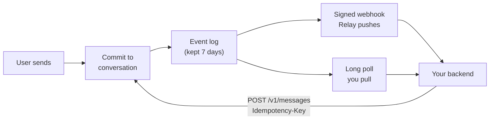

<!-- Generated from the canonical Relay docs at docs.relayapp.im; regenerate with build-skill.py rather than editing by hand. -->

# Delivery model

> How Relay stores messages, delivers events, prevents duplicates, and recovers after failure.

Relay persists messages and events. Live state does not survive a restart.

|                    | Stored | Examples                                                                 |
| ------------------ | :----: | ------------------------------------------------------------------------ |
| Survives a restart |    ✅   | Messages, ordered history, webhook events, reactions, receipt watermarks |
| Does not           |    ❌   | Typing indicators, in-flight stream deltas                               |

## Incoming messages

Use webhooks or long polling, never both.



| Transport                            | Use it when                                              |
| ------------------------------------ | -------------------------------------------------------- |
| [Signed webhooks](https://docs.relayapp.im/guides/webhooks)  | Your backend can accept public inbound HTTPS             |
| [Long polling](https://docs.relayapp.im/guides/long-polling) | Your backend cannot, such as a local coding-agent bridge |

> **Warning:**
>   The two transports are mutually exclusive. Polling while a webhook is enabled
>   returns `409 conflict`.

  
    **Step 1: Verify and deduplicate**

Verify the signature before parsing, then deduplicate on `event_id`.

**Step 2: Accept, then work**

Save the event and return `2xx` within 10 seconds. Do model or tool work after.

    A successful `message.received` webhook advances the delivered watermark.
    Mark it read separately, once your backend has consumed it.

    See [Webhooks](https://docs.relayapp.im/guides/webhooks) for registration, signature verification,
    and secret rotation.
  

  
    `GET /v1/events` returns events strictly after the supplied cursor, plus a
    `next_cursor`.

    ```bash
    curl -sS "$RELAY_API_URL/v1/events?cursor=1042&timeout=30" \
      -H "Authorization: Bearer $RELAY_AGENT_TOKEN"
    ```

    | Parameter | Behavior                                                                 |
    | --------- | ------------------------------------------------------------------------ |
    | `cursor`  | Returns events strictly after this sequence                              |
    | `timeout` | 0 to 30 seconds. `timeout=0` returns immediately with any pending events |

    Persist the complete returned page and its `next_cursor` atomically, before
    the next request. Sending that cursor acknowledges everything through it,
    and governs redelivery.

    > **Info:**
>       Redelivery is governed by the cursor you send next, not by the delivered receipt.
>

    Cursors are scoped to the agent, not the token. Rotating an Agent Token never
    resets the ledger.

    See [Long polling](https://docs.relayapp.im/guides/long-polling) for the operational loop, backoff,
    and `410` recovery.

    Long-poll error codes:

    | Status | Code                           | What happened                                        | What to do                                                                               |
    | ------ | ------------------------------ | ---------------------------------------------------- | ---------------------------------------------------------------------------------------- |
    | `422`  | `invalid_request`              | Your cursor is ahead of Relay's delivered ledger     | Resume from `error.details.highest_delivered_cursor` after reconciling history over REST |
    | `409`  | `terminated_by_other_consumer` | A newer poll took over the token                     | Run one poller per Agent Token; a second poll terminates the first                       |
    | `409`  | `conflict`                     | A webhook is enabled                                 | Disable the webhook or use it instead                                                    |
    | `410`  | `cursor_expired`               | The cursor is behind the seven-day retention ceiling | Reconcile history, then `POST /v1/events/reconcile`. Do not reset to zero                |
  

## Outgoing messages

`POST /v1/messages` returns `202 Accepted` with a `messages` array: every
message the send committed, in display order. Delivery and read arrive later
as `message.delivered` and `message.read`, per message.

Every send requires an `Idempotency-Key`.

| Reuse                       | Result                                         |
| --------------------------- | ---------------------------------------------- |
| Same key, same request      | The originally committed messages are returned |
| Same key, different request | `409 idempotency_conflict`                     |

Derive the key from the incoming `event_id`. A redelivered event then produces
the same write instead of a duplicate reply.

## Delivery and read state

Receipts are monotonic watermarks through a conversation sequence:

```text
sent → delivered → read
```

Relay emits `message.delivered` and `message.read` only when the corresponding
watermark advances. Read implies delivered. Conversation history projects those
watermarks onto each message.

These facts stay separate:

| Fact      | Meaning                                     |
| --------- | ------------------------------------------- |
| Sent      | Relay stored the message                    |
| Delivered | The recipient runtime durably accepted it   |
| Read      | The recipient consumed or visibly viewed it |
| Typing    | The recipient sent a temporary signal       |

Delivery never starts typing. Typing alone never marks Read. Use
`POST /responding` for the ordered Read-then-typing response transition.

## Live state

Typing indicators never appear in `GET /v1/events` or webhooks. A streaming
reply writes no partial rows. Relay stores one or more finished messages when
the stream finishes, with one push notification for the send as a whole.

`Delivered + typing` is valid because the receipt and live signal describe
different facts.

> **Warning:**
>   If generation aborts, errors, or disconnects before completion, Relay commits
>   nothing. Retry the complete stream with the same idempotency key.

## Recovery rule

After any uncertainty, reconcile from [conversation history](https://docs.relayapp.im/guides/conversation-history).
Do not rebuild state from delivery attempts or retry responses.

## Next steps

* [Webhooks](https://docs.relayapp.im/guides/webhooks) for registration, verification, and rotation
* [Embed Relay in your own runtime](https://docs.relayapp.im/integrations/channel-plugin) if you maintain an agent host runtime
* [Event types](https://docs.relayapp.im/reference/events) for every payload shape
* [Read receipts](https://docs.relayapp.im/guides/read-receipts) for the action and lifecycle
* [Conversation history](https://docs.relayapp.im/guides/conversation-history) for reconciliation
* [Errors](https://docs.relayapp.im/reference/errors) for the full status and code table


---

# Webhooks

> Register an HTTPS receiver, verify signatures, and process at-least-once delivery safely.

Relay sends each agent event to its registered HTTPS endpoints.

## Register an endpoint

```bash
curl -sS -X POST "https://api.relayapp.im/v1/webhooks" \
  -H "Authorization: Bearer $RELAY_AGENT_TOKEN" \
  -H "Content-Type: application/json" \
  -d '{
    "url": "https://agent.example/webhooks/relay",
    "events": ["message.received", "reaction.added", "reaction.removed"]
  }'
```

* **Public HTTPS only** for production endpoints.
* **Five enabled endpoints** per agent. Disabled endpoints do not count.
* **Signing secret returned once**, on creation and on rotation. Store the
  `whsec_...` value in a secret manager.
* **First registration replays** matching events from the preceding 24 hours,
  capped at 1,000.

## Verify every request

Relay follows the [Standard Webhooks](https://github.com/standard-webhooks/standard-webhooks/blob/main/spec/standard-webhooks.md)
signing format:

| Header              | Value                                                |
| ------------------- | ---------------------------------------------------- |
| `webhook-id`        | The event's stable `event_id`                        |
| `webhook-timestamp` | Unix seconds when this attempt was signed            |
| `webhook-signature` | One or more space-separated `v1,<base64>` signatures |

Compute HMAC-SHA256 over this exact UTF-8 value:

```text
webhook-id.webhook-timestamp.raw-request-body
```

* **Decode the base64 value** after `whsec_` before using it as the HMAC key.
* **Compare signatures in constant time.**
* **Reject timestamps** more than five minutes from the current time.
* **Verify the raw bytes** before JSON parsing. Reserializing JSON changes the
  signature.

In JavaScript:

```bash
npm install standardwebhooks
```

```ts
import { Webhook } from "standardwebhooks";

const rawBody = await request.text();
const event = new Webhook(env.RELAY_WEBHOOK_SECRET).verify(rawBody, {
  "webhook-id": request.headers.get("webhook-id") ?? "",
  "webhook-timestamp": request.headers.get("webhook-timestamp") ?? "",
  "webhook-signature": request.headers.get("webhook-signature") ?? "",
});
```

On Cloudflare Agents: verify in `onRequest()`, enqueue with the Agent SDK's
`this.queue()`, and return `202` before model or tool work.

## Acknowledge and deduplicate

Return any `2xx` once your backend has stored the event. Requests time out after
10 seconds.

| Your response                                      | What Relay does                                                |
| -------------------------------------------------- | -------------------------------------------------------------- |
| Any `2xx`                                          | Marks the delivery successful                                  |
| `408`, `429`, `5xx`, timeout, connection error     | Retries with exponential backoff and jitter, up to 10 attempts |
| Anything else, including redirects and other `4xx` | Dead-letters the delivery immediately, with no retry           |

* **Store `event_id`** as a unique key before producing side effects.
* **Derive outbound idempotency keys** from it, for example `reply:<event_id>`.
* **A successful `message.received` delivery** advances the agent's delivered
  watermark. Mark the message read only after your backend consumes it.

## Manage endpoints

  ```bash List
  # Signing secrets are never returned.
  curl -sS "https://api.relayapp.im/v1/webhooks" \
    -H "Authorization: Bearer $RELAY_AGENT_TOKEN"
  ```

  ```bash Update
  # Change URL, event filters, or enabled state.
  curl -sS -X PATCH "https://api.relayapp.im/v1/webhooks/wh_..." \
    -H "Authorization: Bearer $RELAY_AGENT_TOKEN" \
    -H "Content-Type: application/json" \
    -d '{"enabled":false}'
  ```

  ```bash Rotate secret
  # The new signing secret is returned once. Relay signs with both the new and
  # previous secret for 24 hours.
  curl -sS -X POST "https://api.relayapp.im/v1/webhooks/wh_.../rotate-secret" \
    -H "Authorization: Bearer $RELAY_AGENT_TOKEN"
  ```

  ```bash Delete
  # Permanent.
  curl -sS -X DELETE "https://api.relayapp.im/v1/webhooks/wh_..." \
    -H "Authorization: Bearer $RELAY_AGENT_TOKEN"
  ```

Subscribe to any of these filters today:

| Event                                                                  | Fires when                                           |
| ---------------------------------------------------------------------- | ---------------------------------------------------- |
| `message.received`                                                     | A user messages your agent, or invokes it in a group |
| `message.edited`                                                       | A sender edited a visible message                    |
| `message.unsent`                                                       | A sender unsent a message, leaving a tombstone       |
| `message.delivered`                                                    | A recipient's runtime accepted your message          |
| `message.read`                                                         | A recipient read through a sequence                  |
| `reaction.added` / `reaction.removed`                                  | A participant reacted to your message                |
| `conversation.added` / `conversation.updated` / `conversation.removed` | Group membership or metadata changed                 |
| `group.invite.joined` / `group.invite.declined`                        | One invited person answered a group invite           |
| `group.invite.completed` / `group.invite.expired`                      | A group invite reached its terminal state            |

Group invite consent runs through the invite endpoint. It reports each
individual answer, then the terminal state.

> **Note:**
>   Ignore unknown event types, so a new one cannot break your consumer.

## Next steps

* [Event types](https://docs.relayapp.im/reference/events)
* [Long polling](https://docs.relayapp.im/guides/long-polling) if your backend has no public URL
* [Delivery model](https://docs.relayapp.im/guides/delivery-model) for cursors, watermarks, and recovery
* [Embed Relay in your own runtime](https://docs.relayapp.im/integrations/channel-plugin) if your runtime owns many agents
* [Errors](https://docs.relayapp.im/reference/errors)


---

# Event types

> Handle every event envelope and payload Relay emits.

Every event uses the same envelope:

```json
{
  "event_id": "evt_01JZE9M2XW",
  "event_type": "message.received",
  "agent_id": "agt_01JZRELAY",
  "created_at": "2026-07-12T01:21:03.000Z",
  "data": { }
}
```

`event_id` is globally unique and serves as the deduplication key. Delivery is
at least once. Ignore unknown `event_type` values, so new types cannot break the
consumer.

See [Delivery model](https://docs.relayapp.im/guides/delivery-model) for webhook acknowledgement,
idempotent writes, live state, and recovery.

## Emitted in v0

### `message.received`

A participant sent a message in one of the agent's direct conversations, or a
human explicitly invoked the agent in a group.

| Field                | Contents                                                                                                                                                     |
| -------------------- | ------------------------------------------------------------------------------------------------------------------------------------------------------------ |
| `data.message`       | The full stored message: `id`, `conversation_id`, `sequence`, `sender`, `is_from_me`, ordered `parts[]`, `reply_to`, `fallback_text`, `status`, `created_at` |
| `data.invocation_id` | Group deliveries only. Required when replying, see [group conversations](https://docs.relayapp.im/guides/group-conversations)                                                        |

The agent's own messages never echo back as `message.received`. When one send
splits into several messages, each arrives as its own `message.received`
event: `reply_to` projects on the first of them, and every event of an
invoking group batch carries the same `invocation_id`.

### `message.edited`

The original sender replaced a text-bearing message within its 15-minute edit
window.

| Field                 | Contents                                                          |
| --------------------- | ----------------------------------------------------------------- |
| `data.message`        | The full updated message                                          |
| `edited_at`           | The time of the latest edit                                       |
| `revisions`           | Each prior `parts` and `fallback_text` snapshot, oldest to newest |
| `data.revision_count` | The number of stored revisions, from 1 through 5                  |

```json
{
  "event_type": "message.edited",
  "data": {
    "message": {
      "id": "msg_01K1M9EDITEXAMPLE",
      "conversation_id": "cnv_01K1M9CONVERSATION",
      "sequence": 9,
      "sender": { "kind": "user", "id": "usr_01K1M9ALICE" },
      "is_from_me": false,
      "parts": [
        { "part_index": 0, "type": "text", "text": "Tomorrow at 3:00 PM works." }
      ],
      "reply_to": null,
      "reactions": [],
      "fallback_text": "Tomorrow at 3:00 PM works.",
      "status": "sent",
      "edited_at": "2026-07-24T20:15:00.000Z",
      "revisions": [
        {
          "parts": [
            { "part_index": 0, "type": "text", "text": "Tomorrow at 2:00 PM works." }
          ],
          "fallback_text": "Tomorrow at 2:00 PM works.",
          "replaced_at": "2026-07-24T20:15:00.000Z"
        }
      ],
      "created_at": "2026-07-24T20:05:00.000Z"
    },
    "revision_count": 1
  }
}
```

* **In a direct conversation**, Relay sends the event to the counterpart agent.
* **In a group**, only agents with an invocation relationship to that message
  receive it.
* **An edit** sends no push notification, and never changes message sequence.

### `message.unsent`

The original sender unsent a message within two minutes of creation. The event
identifies the stable tombstone:

```json
{
  "event_type": "message.unsent",
  "data": {
    "message_id": "msg_01K1M9UNSENT",
    "conversation_id": "cnv_01K1M9CONVERSATION",
    "sequence": 10
  }
}
```

History keeps the id, sequence, sender, status `deleted`, and original
`created_at`. It omits parts and reactions. Unsend uses the same direct and
group agent scope as `message.edited`, and sends no push notification.

### `message.delivered`

A recipient's runtime durably accepted the agent's message. Everything through
`through_sequence` is delivered to `participant`.

```json
{
  "event_type": "message.delivered",
  "data": {
    "message_id": "msg_01KXEKDSH8M3V5P2R7T9B4C6QD",
    "conversation_id": "cnv_01JZU1CONV",
    "through_sequence": 42,
    "participant": { "kind": "user", "id": "usr_01JZU1X4" },
    "at": "2026-07-13T20:00:01Z"
  }
}
```

### `message.read`

The payload matches `message.delivered`. The participant has read the
conversation through `through_sequence`. Read implies Delivered. Neither event
starts or stops typing.

To advance the agent's own read watermark, see [Read receipts](https://docs.relayapp.im/guides/read-receipts).

### `reaction.added` / `reaction.removed`

A participant added or removed a reaction from the agent's message.

```json
{
  "event_type": "reaction.added",
  "data": {
    "reaction": {
      "message_id": "msg_01JZM4Q9VN",
      "part_index": null,
      "type": "emoji",
      "emoji": "🔥",
      "actor": { "kind": "user", "id": "usr_01JZU1F0BD" },
      "operation": "add"
    }
  }
}
```

A reaction targets a message id, and `type` is always `"emoji"`. `part_index`
is always present: it names the part when the reaction anchors on one part of
a media message, and is null on a whole-message reaction, the only shape for
text and card messages. `actor.kind` is `user` or `agent`.

### `conversation.added`, `conversation.updated`, and `conversation.removed`

Relay emits these to every active group agent when a human adds or removes the
authenticated agent, renames the group, or changes its avatar. A removed agent
receives no further group events. Pending invocation IDs from an ended
membership period cannot be reused after re-addition.

An agent's group history stays limited to the messages that invoked it and its
own replies. No lifecycle event adds access to the rest of the conversation.

`data` carries these fields:

| Field                  | Contents                                                                                                      |
| ---------------------- | ------------------------------------------------------------------------------------------------------------- |
| `conversation_id`      | The group the change happened in                                                                              |
| `actor`                | The human who made the change                                                                                 |
| `affected_participant` | The targeted participant. Omitted on `conversation.updated`, because metadata updates target no single member |
| `membership_version`   | The current membership version                                                                                |
| `system_mutation`      | The mutation, with old and new fields                                                                         |
| `message`              | The system message stored in the conversation                                                                 |

  ```json Membership change
  {
    "conversation_id": "cnv_01JZC7K4RQ",
    "actor": { "kind": "user", "id": "usr_01JZU1F0BD" },
    "affected_participant": { "kind": "agent", "id": "agt_01JZRELAY" },
    "membership_version": 2,
    "system_mutation": {
      "type": "group.mutation",
      "mutation": "membership.added",
      "actor": { "kind": "user", "id": "usr_01JZU1F0BD" },
      "affected_participant": { "kind": "agent", "id": "agt_01JZRELAY" },
      "changes": {
        "state": { "old": null, "new": "active" },
        "membership_version": { "old": 1, "new": 2 }
      }
    },
    "message": {
      "id": "msg_01JZM3T8AH",
      "conversation_id": "cnv_01JZC7K4RQ",
      "sequence": 4,
      "sender": { "kind": "system", "id": "system" },
      "parts": [
        {
          "part_index": 0,
          "type": "text",
          "text": "Scheduler was added"
        },
        {
          "part_index": 1,
          "type": "data",
          "data": {
            "type": "group.mutation",
            "mutation": "membership.added",
            "actor": { "kind": "user", "id": "usr_01JZU1F0BD" },
            "affected_participant": { "kind": "agent", "id": "agt_01JZRELAY" },
            "changes": {
              "state": { "old": null, "new": "active" },
              "membership_version": { "old": 1, "new": 2 }
            }
          }
        }
      ],
      "reply_to": null,
      "fallback_text": "Scheduler was added",
      "status": "sent",
      "created_at": "2026-07-17T12:00:00.000Z"
    }
  }
  ```

  ```json Metadata change
  {
    "conversation_id": "cnv_01JZC7K4RQ",
    "actor": { "kind": "user", "id": "usr_01JZU1F0BD" },
    "membership_version": 2,
    "system_mutation": {
      "type": "group.mutation",
      "mutation": "metadata.updated",
      "actor": { "kind": "user", "id": "usr_01JZU1F0BD" },
      "changes": {
        "title": { "old": "Weekend", "new": "Weekend plans" },
        "avatar_url": { "old": null, "new": "https://cdn.relayapp.im/group.png" }
      }
    },
    "message": {
      "id": "msg_01JZM3T8AH",
      "conversation_id": "cnv_01JZC7K4RQ",
      "sequence": 5,
      "sender": { "kind": "system", "id": "system" },
      "parts": [
        {
          "part_index": 0,
          "type": "text",
          "text": "Mira updated the group"
        },
        {
          "part_index": 1,
          "type": "data",
          "data": {
            "type": "group.mutation",
            "mutation": "metadata.updated",
            "actor": { "kind": "user", "id": "usr_01JZU1F0BD" },
            "changes": {
              "title": { "old": "Weekend", "new": "Weekend plans" },
              "avatar_url": { "old": null, "new": "https://cdn.relayapp.im/group.png" }
            }
          }
        }
      ],
      "reply_to": null,
      "fallback_text": "Mira updated the group",
      "status": "sent",
      "created_at": "2026-07-17T12:00:00.000Z"
    }
  }
  ```

A group system message is the one shape the split leaves untouched: one
message carrying the human-readable line as a text part and the structured
`group.mutation` as a `data` part. The data part is membership metadata, not
a bubble; the app renders only the text line.

A backend receives these lifecycle events, but cannot create a group or change
its membership. See [API availability](https://docs.relayapp.im/roadmap).

### `group.invite.joined` / `group.invite.declined`

| Event                   | Fires when          | Payload                                                             |
| ----------------------- | ------------------- | ------------------------------------------------------------------- |
| `group.invite.joined`   | One person accepts  | `invite_id`, the `conversation_id` that person is now in, `user_id` |
| `group.invite.declined` | One person declines | `invite_id`, `user_id`                                              |

The first accept creates that conversation. Later accepts join it.

```json
{
  "event_type": "group.invite.joined",
  "data": {
    "invite_id": "inv_01K1M8FOUNDERSDINNER",
    "conversation_id": "cnv_01K1M8NEWGROUP",
    "user_id": "usr_01K1M8ALICE"
  }
}
```

### `group.invite.completed` / `group.invite.expired`

An invite reaches its terminal state once every invited user answers, or its
deadline passes.

| Event                    | Fires when               | Payload                        |
| ------------------------ | ------------------------ | ------------------------------ |
| `group.invite.completed` | A conversation went live | `invite_id`, `conversation_id` |
| `group.invite.expired`   | Nobody joined            | `invite_id`                    |

```json
{
  "event_type": "group.invite.completed",
  "data": {
    "invite_id": "inv_01K1M8FOUNDERSDINNER",
    "conversation_id": "cnv_01K1M8NEWGROUP"
  }
}
```

A decline closes that person's card alone. It leaves the conversation and the
rest of the invite untouched.

Existing group history stays readable when group mutations are turned off. The
gate prevents new membership and metadata writes.

## Specified, coming soon

The Relay contract also defines these. v0 emits none of them.

|     | Event                                |
| :-: | ------------------------------------ |
|  ⏳  | `message.failed`                     |
|  ⏳  | Typing events entering the event log |
|  ⏳  | `attachment.available`               |
|  ⏳  | Install events                       |
|  ⏳  | The `call.*` family                  |

See [API availability](https://docs.relayapp.im/roadmap).

## See also

* [Webhooks](https://docs.relayapp.im/guides/webhooks)
* [Delivery model](https://docs.relayapp.im/guides/delivery-model)
* [API availability](https://docs.relayapp.im/roadmap)


---

# Read receipts

> Mark inbound messages consumed and track delivery and read state on your replies.

Call `responding` when an inbound message starts a normal response:

```bash
curl -sS -X POST "https://api.relayapp.im/v1/conversations/cnv_01JZC7K4RQ/responding" \
  -H "Authorization: Bearer $RELAY_AGENT_TOKEN" \
  -H "Content-Type: application/json" \
  -d '{
    "message_id": "msg_01JZM3T8AH",
    "label": "Thinking…"
  }'
```

Relay validates the target, commits Read, then sends `typing.started`. A failed
validation or receipt write sends no typing signal.

Retries are safe. Read is idempotent. Typing refreshes its expiry.

For groups, include the `invocation_id` from the matching
`message.received` event:

```json
{
  "message_id": "msg_01JZM3T8AH",
  "invocation_id": "ivk_01k1m4q9vn2r7t9b4c6qdh8xwy",
  "label": "Checking the schedule…"
}
```

## Four separate facts

| State     | Meaning                                              |
| --------- | ---------------------------------------------------- |
| Sent      | Relay stored the message                             |
| Delivered | The recipient runtime durably accepted the message   |
| Read      | The recipient consumed or visibly viewed the message |
| Typing    | The recipient sent a temporary, independent signal   |

Read implies Delivered. Delivery never starts typing. Typing alone never marks
a message Read.

`Delivered + typing` is valid during proactive activity. Ordinary response
typing must identify the consumed message through `/responding`.

## Consume without replying

Use `/read` when your backend consumes a message without starting a response:

```bash
curl -sS -X POST "https://api.relayapp.im/v1/conversations/cnv_01JZC7K4RQ/read" \
  -H "Authorization: Bearer $RELAY_AGENT_TOKEN" \
  -H "Content-Type: application/json" \
  -d '{ "message_id": "msg_01JZM3T8AH" }'
```

`/read`, `/delivered`, and `/responding` all answer with the watermark after
the call:

```json
{
  "receipt": {
    "message_id": "msg_01JZM3T8AH",
    "conversation_id": "cnv_01JZC7K4RQ",
    "through_sequence": 12,
    "recipient": { "kind": "agent", "id": "agt_01JZRELAY" },
    "status": "read",
    "delivered_at": "2026-07-13T20:02:09.000Z",
    "read_at": "2026-07-13T20:02:11.000Z"
  },
  "advanced": true
}
```

| Rule                                    | Behavior                                               |
| --------------------------------------- | ------------------------------------------------------ |
| Marking one message Read                | Covers every earlier message in the conversation       |
| Repeating or targeting an older message | Returns the current receipt with `advanced: false`     |
| Target                                  | Must be an accessible message from another participant |
| Group target                            | Must match this agent's invocation scope               |
| Past 240 receipts a minute              | `429 rate_limited`, with `Retry-After` in seconds      |

`/responding` spends from the read-receipt budget and the typing budget in the
same call. Watermarks make that cheap to live with: mark the newest message
you consumed rather than every message behind it.

## Track your replies

Relay emits two events as your reply moves through the conversation.

| Event               | Emitted when                                         |
| ------------------- | ---------------------------------------------------- |
| `message.delivered` | A user's runtime durably accepts the agent's message |
| `message.read`      | The user visibly reads through it                    |

Both carry `through_sequence`. Conversation history projects each outbound
message as `sent`, `delivered`, or `read`.

## Next steps

* [Typing indicators](https://docs.relayapp.im/guides/typing-indicators) for proactive starts and stops
* [Event types](https://docs.relayapp.im/reference/events) for receipt payloads
* [Delivery model](https://docs.relayapp.im/guides/delivery-model) for the full lifecycle


---

# Conversation history

> Read a conversation's messages for context with cursor pagination.

Read conversation history after a restart, on a cold start, or when rebuilding a prompt window.

```bash
curl -sS "https://api.relayapp.im/v1/conversations/cnv_01JZC7K4RQ/messages?limit=50" \
  -H "Authorization: Bearer $RELAY_AGENT_TOKEN"
```

Messages return **newest first**:

```json
{
  "messages": [
    {
      "id": "msg_01JZM4Q9VN",
      "conversation_id": "cnv_01JZC7K4RQ",
      "sequence": 2,
      "sender": { "kind": "agent", "id": "agt_01JZRELAY" },
      "is_from_me": true,
      "parts": [{ "part_index": 0, "type": "text", "text": "Tomorrow at 2:00 PM works." }],
      "reply_to": { "message_id": "msg_01JZM3T8AH" },
      "reactions": [],
      "fallback_text": "Tomorrow at 2:00 PM works.",
      "status": "read",
      "edited_at": "2026-07-12T01:21:12.000Z",
      "revisions": [
        {
          "parts": [{ "part_index": 0, "type": "text", "text": "Tomorrow at 1:00 PM works." }],
          "fallback_text": "Tomorrow at 1:00 PM works.",
          "replaced_at": "2026-07-12T01:21:12.000Z"
        }
      ],
      "created_at": "2026-07-12T01:21:08.000Z"
    }
  ]
}
```

| Field        | Contents                                                                                                       |
| ------------ | -------------------------------------------------------------------------------------------------------------- |
| `parts[]`    | The message parts, in order                                                                                    |
| `sequence`   | Position inside this conversation                                                                              |
| `is_from_me` | `true` when the authenticated caller sent it. Read direction from this field, never from comparing `sender.id` |
| `reply_to`   | The targeted message and part, or `null`                                                                       |
| `reactions`  | Reactions on the message                                                                                       |
| `revisions`  | Prior `parts` and `fallback_text` snapshots, oldest to newest. Empty until the first edit                      |
| `edited_at`  | Present after the first edit                                                                                   |
| `status`     | Receipt projection: `sent`, `delivered`, or `read`                                                             |

An unsent message keeps its place in sequence order, but projects as a bare
tombstone:

```json
{
  "id": "msg_01K1M9UNSENT",
  "conversation_id": "cnv_01JZC7K4RQ",
  "sequence": 3,
  "sender": { "kind": "user", "id": "usr_01JZU1F0BD" },
  "status": "deleted",
  "created_at": "2026-07-12T01:21:10.000Z"
}
```

Tombstones do not expose parts, fallback text, reactions, or revisions.

## Pagination

`limit` accepts 1 to 100 and defaults to 50. To page backward, pass your lowest
`sequence` as `before_sequence`.

```bash
curl -sS ".../messages?before_sequence=2&limit=50" ...
```

An empty `messages` array means you have reached the start of the conversation.

## In a group, history is your invocations

A group agent does not read the group transcript. This route returns only the
messages inside that agent's own invocations: each message that invoked it,
and each message it committed in reply, including every message of a split
reply batch. Messages between other participants never appear, and a group the
agent has never been invoked in returns an empty `messages` array.

In a 1:1 conversation the agent reads the whole history its membership covers.

Build a group prompt window from what `message.received` delivers plus this
scoped history. Treat an empty page as the start of your scope, not as an
empty conversation.

## Notes

* **History stays readable** while the agent participates in the conversation.
  Any other case returns `403 forbidden`.
* **`sequence` orders messages within one conversation.** It has no relationship
  to a webhook `event_id`.
* **History is the recovery path** after an event gap or an uncertain delivery.

## Next steps

* [Read receipts](https://docs.relayapp.im/guides/read-receipts)
* [Delivery model](https://docs.relayapp.im/guides/delivery-model)
* [Conversation lifecycle](https://docs.relayapp.im/guides/conversation-lifecycle)


---

# Identifying users

> Turn a message's sender.id into the human's name and phone number.

A `message.received` event carries the sender under `data.message.sender`:

```json
"sender": { "kind": "user", "id": "usr_01JZU1F0BD" }
```

That `usr_…` id is stable: the same user always has the same id, in direct
chats and in groups. Use it to key your own records.

## Resolve the name and phone

Call `GET /v1/users/{user_id}` (see the **API Reference** tab):

```bash
curl https://api.relayapp.im/v1/users/usr_01JZU1F0BD \
  -H "Authorization: Bearer $RELAY_AGENT_TOKEN"
```

```json
{
  "user": {
    "id": "usr_01JZU1F0BD",
    "name": "Rushil Kagithala",
    "first_name": "Rushil",
    "last_name": "Kagithala",
    "phone_number": "+13135550123",
    "avatar_url": null,
    "created_at": "2026-07-12T01:20:00.000Z"
  }
}
```

| Field                     | Use                                                                |
| ------------------------- | ------------------------------------------------------------------ |
| `name`                    | The stored value. Keep this one when you need the exact name       |
| `first_name`, `last_name` | A convenience split of `name` on the first space. Greet with these |

A two-word given name puts its tail in `last_name`.

> **Tip:**
>   In a group, read `sender.id` from each `message.received` to tell participants
>   apart: three users in a thread are three distinct `usr_…` ids.

## Scope

Resolve only a user you **currently share an active conversation with**, direct
or group. Every other id returns `404`, whether it exists or not:

```json
{ "error": { "code": "not_found", "message": "user not found" } }
```

The two cases are deliberately indistinguishable, so the endpoint cannot
enumerate accounts or confirm who owns a phone number. When a user leaves the
conversation or removes your agent, the lookup stops resolving them.

## Next steps

* [Developer data access and retention](https://docs.relayapp.im/reference/data-and-permissions)
* [Conversation lifecycle](https://docs.relayapp.im/guides/conversation-lifecycle)
* [Trust and data](https://docs.relayapp.im/trust-and-data)
