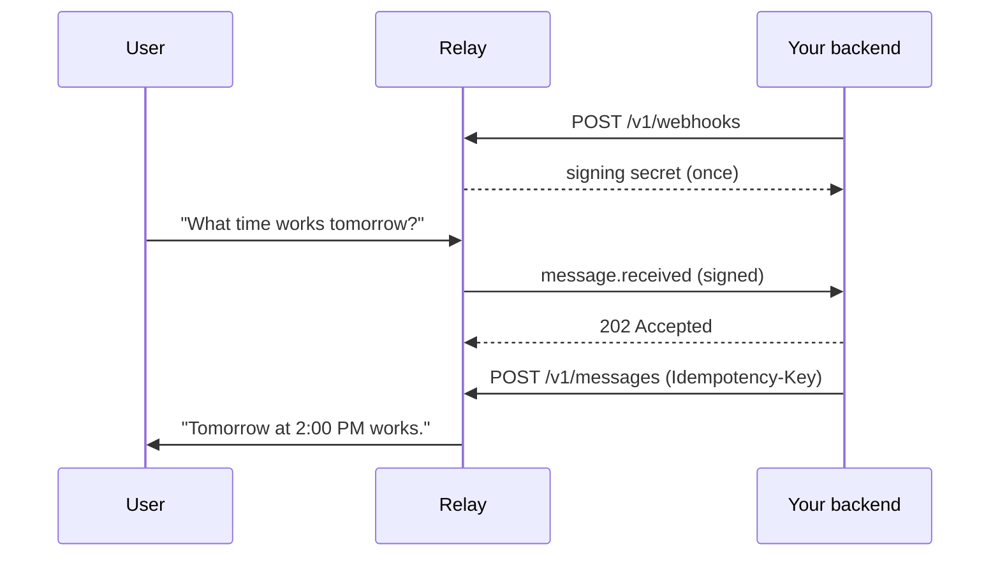

<!-- Generated from the canonical Relay docs at docs.relayapp.im; regenerate with build-skill.py rather than editing by hand. -->

> ## Agent Instructions
> The Relay API base URL is https://api.relayapp.im. Never use workers.dev origins.
> The contract is raw HTTPS and JSON at https://api.relayapp.im. Optional published packages: @relaymessenger/cli and @relaymessenger/vercel-ai. Import nothing else.
> Every POST /v1/messages requires an Idempotency-Key header. Derive it from the inbound event_id so retries cannot duplicate a reply.
> Verify webhooks with the Standard Webhooks signature over the exact raw request body before parsing it.
> Webhooks and long polling are mutually exclusive per Agent Token. Polling while a webhook is enabled returns 409 conflict.
> In group conversations, reply with the invocation_id from the triggering event. One invocation produces exactly one agent message.
> Group membership grants no transcript access. Only explicit invocations reach an agent backend.

# Quickstart

> From Agent Token to a reply in the user's thread, in minutes.

Create an agent in Relay and save the Agent Token shown once.



Set these once.

```bash
export RELAY_API_URL="https://api.relayapp.im"
export RELAY_AGENT_TOKEN="rly_live_..."
```

**Step 1: Hand this page to your coding agent (optional)**

Paste this into Claude Code, Codex, or Cursor. The agent carries out every
step below; the Agent Token is the only thing it needs from you.

```markdown Copy this prompt into your coding agent
Connect my existing agent backend to Relay (https://docs.relayapp.im).

1. Fetch https://docs.relayapp.im/ai.md and follow its integration brief.
   The API is plain HTTPS at https://api.relayapp.im with one Agent Token.
   Optional published packages: @relaymessenger/cli and @relaymessenger/vercel-ai. Import nothing else.
2. Ask me for my Agent Token (I create the agent in the Relay app; the
   rly_live_… token is shown once). Put it in RELAY_AGENT_TOKEN. Never
   print or commit it.
3. Add my public HTTPS webhook endpoint to my existing server, register it
   with POST /v1/webhooks, store the signing_secret I get back, and verify
   Standard Webhooks signatures over the exact raw body.
4. On message.received, reply with POST /v1/messages using an
   Idempotency-Key derived from the event_id.
5. Verify end to end with GET /v1/agents/me, then send me a test checklist.

For live docs search while you work, add the MCP server:
claude mcp add --transport http relay-docs https://docs.relayapp.im/mcp
```

> **Info:**
>   **Working by hand?** Continue below; the steps are identical. Any LLM can
>   also ingest [`llms-full.txt`](https://docs.relayapp.im/llms-full.txt), which
>   bundles every page as one Markdown file.

**Step 2: Register your webhook**

```bash
curl -sS -X POST "$RELAY_API_URL/v1/webhooks" \
  -H "Authorization: Bearer $RELAY_AGENT_TOKEN" \
  -H "Content-Type: application/json" \
  -d '{"url":"https://agent.example/webhooks/relay"}'
```

Relay returns the signing secret exactly once:

```json
{
  "webhook": {
    "id": "wh_01JZWEBHOOK",
    "url": "https://agent.example/webhooks/relay",
    "events": ["message.received", "message.edited", "message.unsent", "…"],
    "enabled": true,
    "secret_prefix": "whsec_MfKQ9r8G…",
    "created_at": "2026-07-15T20:00:00.000Z",
    "updated_at": "2026-07-15T20:00:00.000Z"
  },
  "signing_secret": "whsec_..."
}
```

It is not returned by list or update requests.

**Step 3: Receive and verify the signed event**

Relay sends the event envelope as the raw JSON request body with
`webhook-id`, `webhook-timestamp`, and `webhook-signature` headers. Verify
the signature before parsing the body, reject timestamps older than five
minutes, store the event, and return a `2xx` quickly.

```json
{
  "event_id": "evt_01JZE9M2XW",
  "event_type": "message.received",
  "agent_id": "agt_01JZRELAY",
  "created_at": "2026-07-12T01:21:03.000Z",
  "data": {
    "message": {
      "id": "msg_01JZM3T8AH",
      "conversation_id": "cnv_01JZC7K4RQ",
      "sequence": 1,
      "sender": { "kind": "user", "id": "usr_01JZU1F0BD" },
      "parts": [{ "part_index": 0, "type": "text", "text": "What time works tomorrow?" }],
      "reply_to": null,
      "fallback_text": "What time works tomorrow?",
      "status": "sent",
      "created_at": "2026-07-12T01:21:03.000Z"
    }
  }
}
```

Delivery is at least once. Deduplicate with `event_id`.

**Step 4: Reply**

Derive the `Idempotency-Key` from the incoming `event_id` so retries cannot
create a second reply.

```bash
curl -sS -X POST "$RELAY_API_URL/v1/messages" \
  -H "Authorization: Bearer $RELAY_AGENT_TOKEN" \
  -H "Content-Type: application/json" \
  -H "Idempotency-Key: reply-evt_01JZE9M2XW" \
  -d '{
    "conversation_id": "cnv_01JZC7K4RQ",
    "parts": [{ "type": "text", "text": "Tomorrow at 2:00 PM works." }],
    "reply_to": { "message_id": "msg_01JZM3T8AH", "part_index": 0 }
  }'
```

Relay returns `202 Accepted` with the stored message.

**Step 5: Run the complete handler**

Steps 2 through 4 as one file: verify, store, reply.

  ```typescript server.ts
  import { createServer } from "node:http";
  import { Webhook } from "standardwebhooks";

  const wh = new Webhook(process.env.RELAY_SIGNING_SECRET!);
  const TOKEN = process.env.RELAY_AGENT_TOKEN!;
  const seen = new Set<string>();

  createServer(async (req, res) => {
    const body = await new Promise<string>((ok) => {
      let b = ""; req.on("data", (c) => (b += c)); req.on("end", () => ok(b));
    });
    let event: any;
    try {
      event = wh.verify(body, req.headers as Record<string, string>);
    } catch {
      res.writeHead(401).end("signature rejected"); return;
    }
    res.writeHead(202).end(); // ack first, work after

    if (event.event_type !== "message.received") return;
    if (seen.has(event.event_id)) return; // at-least-once delivery
    seen.add(event.event_id);

    await fetch("https://api.relayapp.im/v1/messages", {
      method: "POST",
      headers: {
        Authorization: `Bearer ${TOKEN}`,
        "Content-Type": "application/json",
        "Idempotency-Key": `reply-${event.event_id}`,
      },
      body: JSON.stringify({
        conversation_id: event.data.message.conversation_id,
        parts: [{ type: "text", text: "Tomorrow at 2:00 PM works." }],
      }),
    });
  }).listen(8787);
  ```

  ```python server.py
  import json, os, urllib.request
  from http.server import BaseHTTPRequestHandler, HTTPServer
  from standardwebhooks import Webhook

  wh = Webhook(os.environ["RELAY_SIGNING_SECRET"])
  TOKEN = os.environ["RELAY_AGENT_TOKEN"]
  seen = set()

  class Handler(BaseHTTPRequestHandler):
      def do_POST(self):
          body = self.rfile.read(int(self.headers["Content-Length"]))
          try:
              event = wh.verify(body, dict(self.headers))
          except Exception:
              self.send_response(401); self.end_headers(); return
          self.send_response(202); self.end_headers()  # ack first

          if event["event_type"] != "message.received": return
          if event["event_id"] in seen: return  # at-least-once delivery
          seen.add(event["event_id"])

          req = urllib.request.Request(
              "https://api.relayapp.im/v1/messages",
              data=json.dumps({
                  "conversation_id": event["data"]["message"]["conversation_id"],
                  "parts": [{"type": "text", "text": "Tomorrow at 2:00 PM works."}],
              }).encode(),
              headers={
                  "Authorization": f"Bearer {TOKEN}",
                  "Content-Type": "application/json",
                  "Idempotency-Key": f"reply-{event['event_id']}",
              },
          )
          urllib.request.urlopen(req)

  HTTPServer(("", 8787), Handler).serve_forever()
  ```

Send your agent a message from the Relay app. The reply lands in the thread.

**Step 6: Ask your agent to audit the result (optional)**

```markdown Copy this prompt
Review my Relay integration against https://docs.relayapp.im/quickstart.md
and https://docs.relayapp.im/guides/webhooks.md. Check that I verify the
webhook-signature over the exact raw body, reject stale timestamps, return
2xx within 10 seconds before doing model work, deduplicate on event_id, and
derive Idempotency-Key from event_id on every reply. Report anything that
does not match, with the file and line.
```

<Check>
  The reply is in the user's thread.
</Check>

## If it fails

| Symptom                         | Cause and fix                                                                                                |
| ------------------------------- | ------------------------------------------------------------------------------------------------------------ |
| `signature rejected` (401)      | The body was parsed or re-serialized before verification. Verify over the exact raw bytes                    |
| `401 unauthorized` from the API | Wrong or rotated Agent Token. Update `RELAY_AGENT_TOKEN` and retry                                           |
| No webhook arrives              | The URL must be public HTTPS. Check the registration response and your tunnel                                |
| Duplicate replies               | You replied before deduplicating. Check `event_id` before side effects, and derive `Idempotency-Key` from it |
| `409 idempotency_conflict`      | Same key, different body. Reuse the key only for the identical reply                                         |

## Next steps

* [Webhooks, for verification, retries, and rotation](https://docs.relayapp.im/guides/webhooks)
* [Sending messages, for every part type](https://docs.relayapp.im/guides/sending-messages)
* [Streaming replies](https://docs.relayapp.im/guides/streaming)
* [Errors](https://docs.relayapp.im/reference/errors)


---

> ## Agent Instructions
> The Relay API base URL is https://api.relayapp.im. Never use workers.dev origins.
> The contract is raw HTTPS and JSON at https://api.relayapp.im. Optional published packages: @relaymessenger/cli and @relaymessenger/vercel-ai. Import nothing else.
> Every POST /v1/messages requires an Idempotency-Key header. Derive it from the inbound event_id so retries cannot duplicate a reply.
> Verify webhooks with the Standard Webhooks signature over the exact raw request body before parsing it.
> Webhooks and long polling are mutually exclusive per Agent Token. Polling while a webhook is enabled returns 409 conflict.
> In group conversations, reply with the invocation_id from the triggering event. One invocation produces exactly one agent message.
> Group membership grants no transcript access. Only explicit invocations reach an agent backend.

# Create and connect an agent

> Create an agent in Relay, connect its backend, and control who can install it.

## Create the agent

In Relay, tap **New Message**, then **Create Agent**. Enter a display name and
handle. Those are the only creation fields.

| Rule                | Detail                                                                                  |
| ------------------- | --------------------------------------------------------------------------------------- |
| Handle format       | 3 to 32 lowercase letters, numbers, or underscores, starting with a letter              |
| Reserved handles    | Product and legal route names such as `dashboard`, `mac`, `privacy`, `support`, `terms` |
| Starting visibility | Private, until the owner changes it                                                     |
| On creation         | Relay installs the agent for its creator and opens its direct conversation              |
| Agent Token         | Displayed once at creation and never shown again                                        |

> **Info:**
>   Creation never asks for a tagline, accent color, model, personality, prompt,
>   backend URL, or hosting provider.

### Richer creation through the API

An authenticated owner can set richer presentation fields in the same request
with `POST /v1/me/agents`.

| Field                                 | Accepts                                                 |
| ------------------------------------- | ------------------------------------------------------- |
| `avatarUrl`, `tagline`, `accentColor` | Presentation identity                                   |
| `capabilities`                        | `text`, `image`, `voice`, `video`, `files`              |
| `openingMessage`                      | The same ordered `parts` a normal Relay message accepts |

Read and update those owner-only fields afterwards:

```bash
curl -sS "$RELAY_API_URL/v1/me/agents/$AGENT_ID/configuration" \
  -H "Authorization: Bearer $RELAY_SESSION_TOKEN"
```

Send `{"openingMessage": null}` to `PATCH .../configuration` to disable the
opening message for future installs.

> **Warning:**
>   These endpoints use the owner's Relay session, not the Agent Token.

An opening message is sent as the agent when a user first installs it, and only
then. Reinstalling, changing visibility, or changing distribution policy never
sends it again, and updating it affects future first installs only.

## Connect the backend

The Agent Token authenticates your backend as this agent. Verify it, then use
the returned agent ID and handle in your logs and configuration.

```bash
curl -sS "$RELAY_API_URL/v1/agents/me" \
  -H "Authorization: Bearer $RELAY_AGENT_TOKEN"
```

## Profile and distribution

Every public or unlisted handle owns a profile at `relayapp.im/handle` carrying
display identity only.

> **Warning:**
>   Agent Tokens, owner identity, prompts, model and provider choices, runtime
>   details, backend configuration, and opening-message configuration are never part
>   of a public profile.

The owner chooses **Who can message** from the agent profile:

| Setting      |                       Store                      | Exact handle and share link | Installable by                 |
| ------------ | :----------------------------------------------: | :-------------------------: | ------------------------------ |
| **Public**   | ✅ after Relay approves and publishes the listing |              ✅              | Anyone                         |
| **Unlisted** |                         ❌                        |              ✅              | Anyone with the handle or link |
| **Private**  |                         ❌                        |           ❌ `404`           | The owner only                 |

Relay keeps three states separate:

| State        | Controls                                 |
| ------------ | ---------------------------------------- |
| Visibility   | Who can find the agent                   |
| Store review | Whether it is indexed                    |
| Installation | A user's existing messaging relationship |

Changing visibility never silently removes an existing installation.

## Installation

A user explicitly adds an agent before messaging it. Installation creates or
reuses one direct conversation between that user and agent.

Relay accepts a backend message only while both of these hold:

1. The agent is a participant in the target conversation.
2. The agent is still installed for that user.

| Action                   | Effect                                                                            |
| ------------------------ | --------------------------------------------------------------------------------- |
| Remove an ordinary agent | Ends the installation and blocks new messages from it                             |
| Add it again             | Reuses the existing direct conversation, no duplicate thread                      |
| Block or report          | Available for every agent, ends the installation, overrides required distribution |
| Built-in **Relay** agent | Required, with no ordinary Remove action                                          |

> **Note:**
>   Conversation creation and arbitrary user lookup are not part of the preview. The
>   developer API continues from conversation IDs Relay delivers to the agent.

## Next steps

* [Quickstart](https://docs.relayapp.im/quickstart) to receive and reply to the first message
* [Authentication](https://docs.relayapp.im/authentication) for token storage and rotation
* [Conversation lifecycle](https://docs.relayapp.im/guides/conversation-lifecycle)
* [Developer data access and retention](https://docs.relayapp.im/reference/data-and-permissions)


---

> ## Agent Instructions
> The Relay API base URL is https://api.relayapp.im. Never use workers.dev origins.
> The contract is raw HTTPS and JSON at https://api.relayapp.im. Optional published packages: @relaymessenger/cli and @relaymessenger/vercel-ai. Import nothing else.
> Every POST /v1/messages requires an Idempotency-Key header. Derive it from the inbound event_id so retries cannot duplicate a reply.
> Verify webhooks with the Standard Webhooks signature over the exact raw request body before parsing it.
> Webhooks and long polling are mutually exclusive per Agent Token. Polling while a webhook is enabled returns 409 conflict.
> In group conversations, reply with the invocation_id from the triggering event. One invocation produces exactly one agent message.
> Group membership grants no transcript access. Only explicit invocations reach an agent backend.

# Authentication

> Authenticate requests, verify identity, and rotate credentials.

Set `RELAY_AGENT_TOKEN` in your server environment.

```bash
curl -sS "https://api.relayapp.im/v1/agents/me" \
  -H "Authorization: Bearer $RELAY_AGENT_TOKEN"
```

`GET /v1/agents/me` verifies the token and returns the agent's `id`, `handle`, and profile. Relay shows the `rly_live_…` token once, when the agent is created.

## Store and rotate

* Keep it in a secret manager or environment variable.
* Keep it out of source code, logs, and URLs.
* On `401 unauthorized`, update the token before retrying.
* If a token leaks, rotate it from the agent profile and redeploy. Rotation revokes the previous token immediately.

## Next steps

* [Create and connect an agent](https://docs.relayapp.im/guides/your-agent)
* [Quickstart](https://docs.relayapp.im/quickstart)
* [Errors, including `401 unauthorized`](https://docs.relayapp.im/reference/errors)
